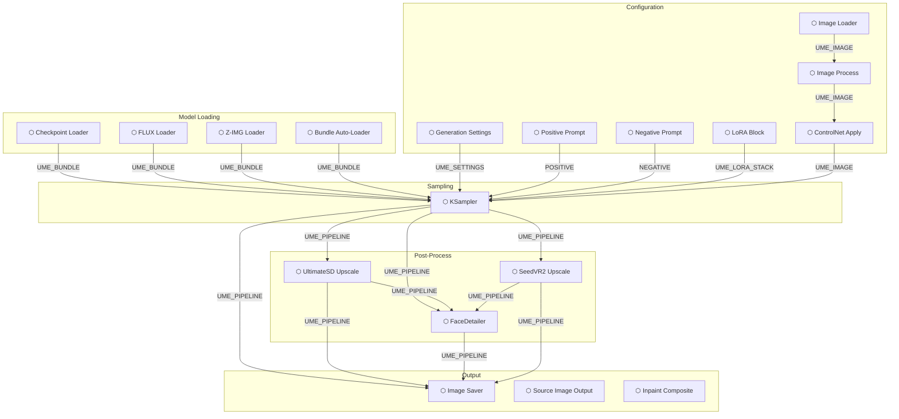
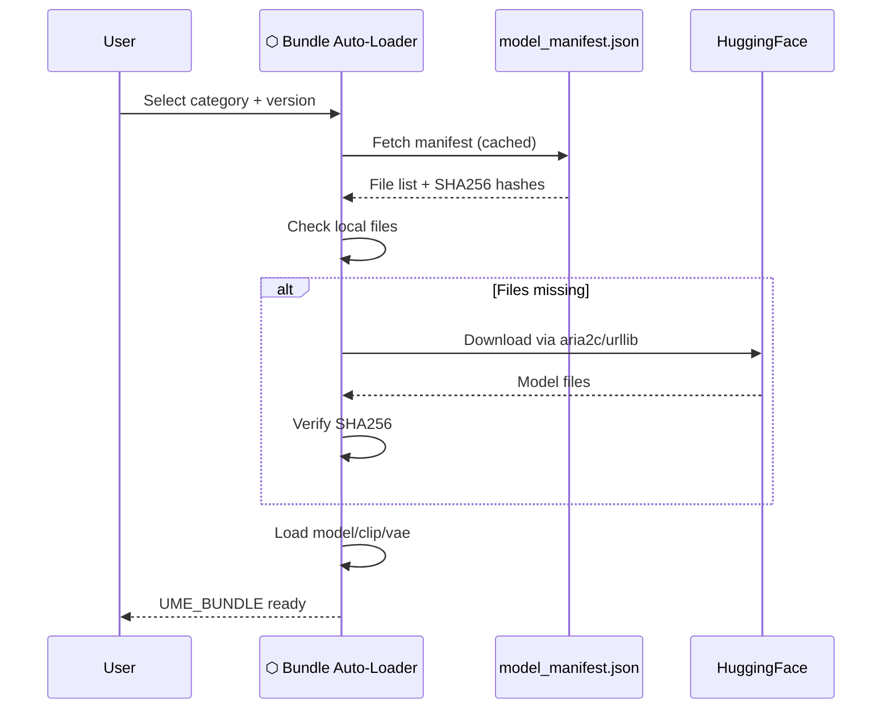

# Architecture

## Block Pipeline

The UmeAiRT Toolkit replaces ComfyUI's traditional spaghetti wiring with a **block architecture**. Instead of connecting individual model/clip/vae/conditioning wires, you pass typed bundles:

| Bundle Type | Contents | Created By |
|-------------|----------|------------|
| `UME_BUNDLE` | model + clip + vae + model_name | Loader nodes |
| `UME_SETTINGS` | width, height, steps, cfg, sampler, scheduler, seed | Generation Settings |
| `UME_IMAGE` | image + mask + mode + denoise + controlnets | Image Loader/Process |
| `UME_LORA_STACK` | list of (name, model_strength, clip_strength) | LoRA Block nodes |
| `UME_PIPELINE` | Full generation context (all of the above + latent + result) | KSampler |

## Data Flow



## Module Structure

```
ComfyUI-UmeAiRT-Toolkit/
├── __init__.py              # Node registration (47 nodes)
├── modules/
│   ├── block_loaders.py     # Model loading nodes
│   ├── block_inputs.py      # LoRA, ControlNet, Settings, Image, Prompts
│   ├── block_sampler.py     # Central KSampler hub
│   ├── logic_nodes.py       # Upscale, FaceDetailer, Detailer Daemon
│   ├── image_nodes.py       # Source Image, Inpaint Composite, Image Saver
│   ├── model_nodes.py       # Multi-LoRA Loader (wired)
│   ├── utils_nodes.py       # Label, Downloader, Unpack, Health Check
│   ├── common.py            # Shared dataclasses and utilities
│   ├── manifest.py          # Model manifest parsing
│   ├── download_utils.py    # Download engine (aria2c + urllib)
│   ├── extra_samplers.py    # Custom sampler registration
│   └── optimization_utils.py # VRAM management, SageAttention
├── web/                     # Frontend JS (widget extensions)
├── docs/                    # This documentation
└── tests/                   # Test suite (140+ tests)
```

## Bundle Auto-Download

The Bundle system uses a remote `model_manifest.json` hosted on [UmeAiRT Assets](https://github.com/UmeAiRT/ComfyUI-Auto-Installer-Assets):


