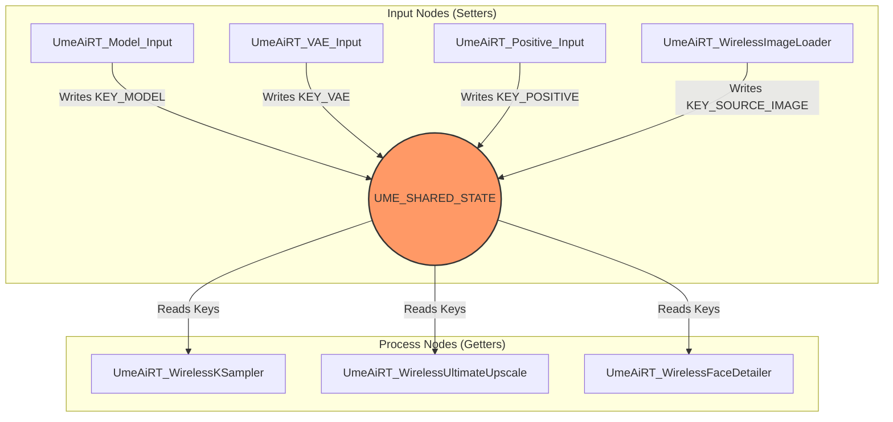

# Wireless Architecture Map

## Overview

The "Wireless" system allows nodes to communicate without visible noodle links in the ComfyUI graph.
It uses a Python dictionary `UME_SHARED_STATE` (located in `modules/wireless.py`) as a central blackboard.

## Modular Structure

The codebase is now split into modules:

- **`modules/wireless.py`**: Core wireless logic, Global State, and Wireless Nodes (KSampler, Upscalers).
- **`modules/blocks.py`**: Atomic "Block" nodes for packing parameters (Settings, Prompts, Models).
- **`modules/controlnet.py`**: ControlNet integration (Unified Loader, Process, Apply).
- **`modules/tools.py`**: Utility nodes (Bundle Downloader, Log Viewer, Seed).
- **`nodes.py`**: Entry point bridge importing all modules.

## Data Flow Diagram

## Internal Keys Reference

These keys are defined as constants in `modules/wireless.py`.

| Key Constant | String Value | Purpose |
|--------------|--------------|---------|
| `KEY_MODEL` | `"ume_internal_model"` | Main Stable Diffusion Model |
| `KEY_VAE` | `"ume_internal_vae"` | VAE Model |
| `KEY_CLIP` | `"ume_internal_clip"` | CLIP Model |
| `KEY_LATENT` | `"ume_internal_latent"` | Current Latent samples |
| `KEY_POSITIVE` | `"ume_internal_positive"` | Positive Prompt (String) |
| `KEY_NEGATIVE` | `"ume_internal_negative"` | Negative Prompt (String) |
| `KEY_SEED` | `"ume_internal_seed"` | Seed Value (Int) |
| `KEY_STEPS` | `"ume_internal_steps"` | Step Count (Int) |
| `KEY_CFG` | `"ume_internal_cfg"` | CFG Scale (Float) |
| `KEY_SAMPLER` | `"ume_internal_sampler"` | Sampler Name (String) |
| `KEY_SCHEDULER` | `"ume_internal_scheduler"` | Scheduler Name (String) |
| `KEY_IMAGESIZE` | `"ume_internal_imagesize"` | Dict `{'width': int, 'height': int}` |
| `KEY_SOURCE_IMAGE` | `"ume_internal_source_image"` | Loaded Input Image |
| `KEY_SOURCE_MASK` | `"ume_internal_source_mask"` | Mask for Inpainting (or None) |
| `KEY_CONTROLNETS` | `"ume_internal_controlnets"` | ControlNet Stack |

## Autonomous Logic

The `UmeAiRT_WirelessKSampler` is the heart of the system.

1. It does NOT take standard inputs (model, positive, etc.).
2. Inside its logic, it calls `UME_SHARED_STATE.get(KEY_...)` to fetch everything it needs.
3. It validates that all required keys are present before running.
