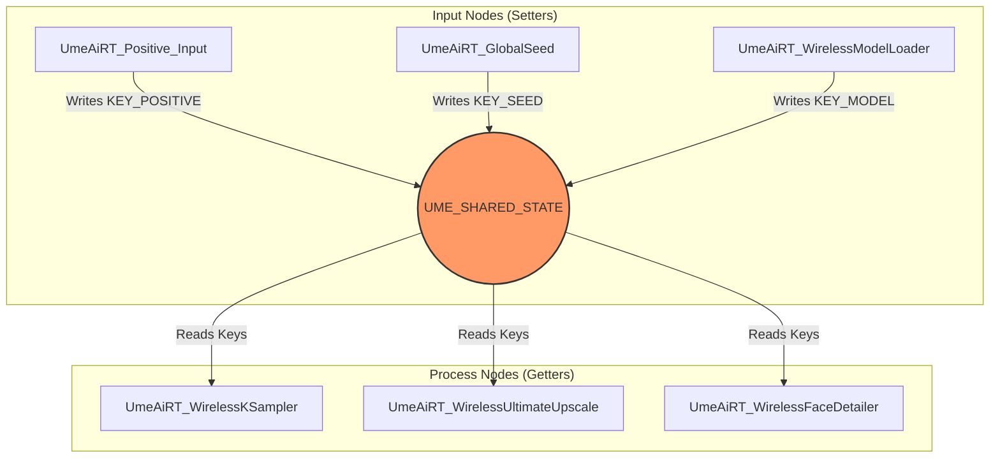

# Wireless Architecture Map

## Overview

The "Wireless" system allows nodes to communicate without visible noodle links in the ComfyUI graph.
It uses a Python dictionary `UME_SHARED_STATE` (located in `modules/common.py`) as a central blackboard.

## Architecture Diagram

## Internal Keys Reference

Keys are defined in `modules/common.py`.

| Key Constant | String Value | Purpose |
|--------------|--------------|---------|
| `KEY_MODEL` | `"ume_internal_model"` | Main Stable Diffusion Model |
| `KEY_VAE` | `"ume_internal_vae"` | VAE Model |
| `KEY_CLIP` | `"ume_internal_clip"` | CLIP Model |
| `KEY_POSITIVE` | `"ume_internal_positive"` | Positive Prompt (String) |
| `KEY_NEGATIVE` | `"ume_internal_negative"` | Negative Prompt (String) |
| `KEY_SEED` | `"ume_internal_seed"` | Seed Value (Int) |
| `KEY_STEPS` | `"ume_internal_steps"` | Step Count (Int) |
| `KEY_CFG` | `"ume_internal_cfg"` | CFG Scale (Float) |
| `KEY_SAMPLER` | `"ume_internal_sampler"` | Sampler Name (String) |
| `KEY_SCHEDULER` | `"ume_internal_scheduler"` | Scheduler Name (String) |

## Implementation Logic

1. **Setters**: Classes like `UmeAiRT_Positive_Input` update the `UME_SHARED_STATE` dictionary directly in their `set_val` method.
2. **Getters**: Classes like `UmeAiRT_WirelessKSampler` implement a `process` method that ignores standard ComfyUI inputs and instead fetches values from `UME_SHARED_STATE.get(KEY_...)`.
3. **Context**: Wrapper functions (like `SamplerContext`) are used to temporarily enable optimizations or handle VRAM management during the execution of getter nodes.
